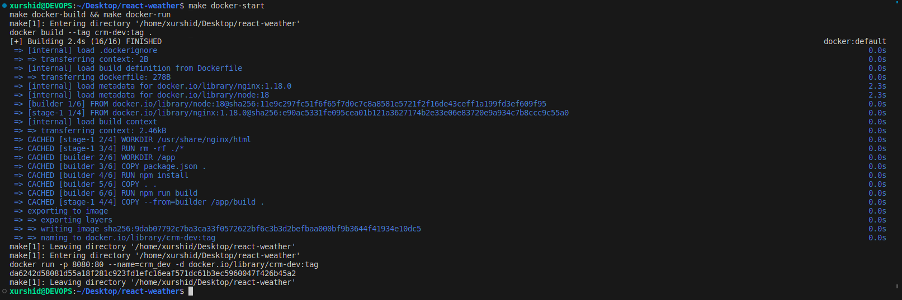
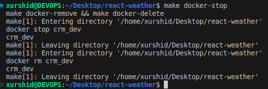

# Makefile da orqali Docker imgni ishga tushiramiz

## 1. Avvalo Dockerfile ma'lumot yozamiz : Masalan 


---

## 2. Keyin Makefile orqali ishga tushiramiz va quyida gi buyruqlarni yozamiz


### Makefile tushuntirin o'taman

1.make docker-build - Terminalga yozganimizda Dockerfile image yaratadi va tag nomini beryapti masalan  : ```crm-dev ```  


## terminalga ``make docker-build`` yozamiz


2. make docker-run - Terminalga yozganda  Dockerfileda image 8080 porti yoqiladi va unga name yoziladi masalan: crm_dev 


## terminalga ``make docker-run`` yozamiz


### ```google-chrome qidiruvga kirib``` http://localhost:8080/ ```yozsangiz loyiha ko'rinadi : Faqat React js Pojectda ishlaydi :  Menda Projectim```


3. make docker-start - Terminalga yozganda  Dockerfileda avval ```docker-build``` keyin ```docker-run``` ishga tushiradi


## terminalga ``make docker-start`` yozamiz




4. make docker-remove -  Terminalga yozganda Docker image to'xtaydi va server o'chadi


## terminalga ``make docker-remove`` yozamiz


### ```google-chrome qidiruvga kirib``` http://localhost:8080/ ```yozsangiz loyiha o'chadi```


5. make docker-delete - Terminalga yozganda Docker image o'chiradi


## terminalga ``make docker-remove`` yozamiz


### ```google-chrome qidiruvga kirib``` http://localhost:8080/ ```yozsangiz hech narsa o'zgarmaydi```


6. make docker-stop - Terminalga yozganda  Dockerfileda avval ```docker-remove``` keyin ```docker-delete``` ishga tushiradi



## terminalga ``make docker-stop`` yozamiz

### ```google-chrome qidiruvga kirib``` http://localhost:8080/ ```yozsangiz loyiha to'xtaydi va  o'chadi```


